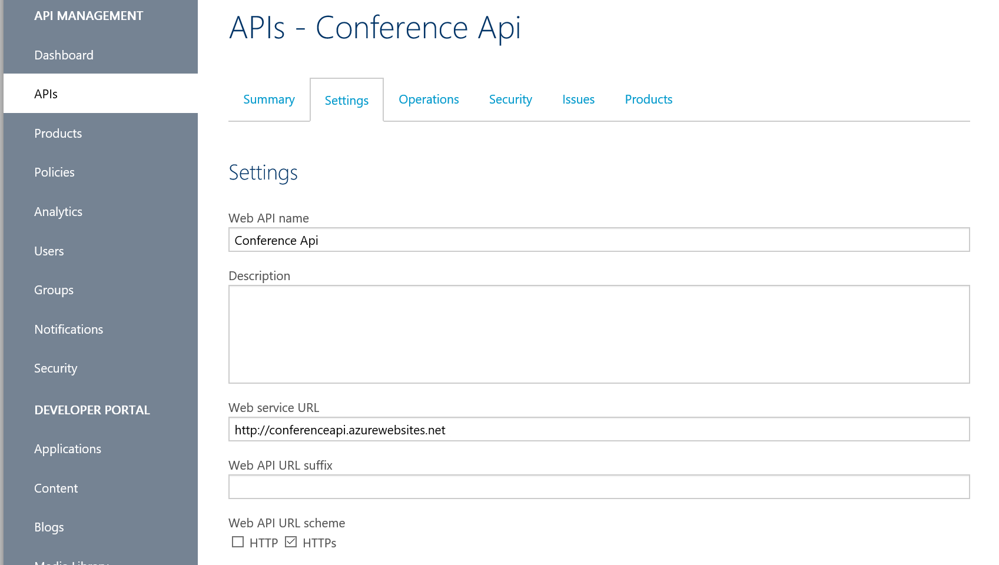

# API Management Bootcamp

## Exploring the Admin Portal

Click Manage to open the Admin Portal

Select APIs in the sidebar to add an API

Go to the Settings tab and enter the Web API Name and the backend URL. For our sample case, enter the conference URL as shown below.

Go to the Products section using the sidebar.

Add a product

Free products don’t require keys that are managed and authorized by the portal. Go back to edit the product.

Click Add API to Product.

Select Conference Api and Save.

Publish the Product so that we can use it.

Hit the backend API using your preferred HTTP request making tool. Browser, Postman, Fiddler, Runscope, etc.

Hit the frontend API

Policies

Check the Header

Cleanup headers

Change API to use Starter Product

Review policy scope and select Starter

Click View Effective Policy

Request that will fail

Get a subscription key

Add the subscription key

Add the trace flag

Find the trace location and go and take a look

# Recap :

> We fronted and API with APIM
>
> We manipulated the message
>
> We protected the API from unauthorized and abusive usage
>
> We found out how to debug APIM behavior

## Helping Your Developer Users

Social Logins Available in the Admin Portal

Reply to your confirmation email

Subscribe to a Product

And get their keys

Register an app

And submit to App store.

Publish from the admin portal

API Docs and Console

Houston, we have a problem. That’s not exactly useful documentation for the API.

You can do it all yourself, by creating custom Content pages,

And hooking them up to the menu.

But we would rather not re-implement the docs pages with the Try functionality.

So back to the admin portal

