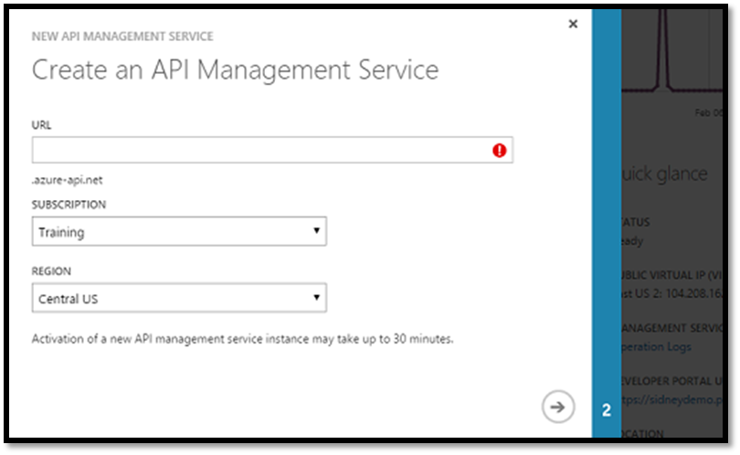

# API Management Bootcamp

Microsoft Azure API Management ensures that your API program reaches its fullest potential. With API management, publish web services as APIs reliably, securely, and at scale.

Use API Management to drive API consumption among internal teams, partners, and developers, while benefiting from the business and operational insights available in the Azure portal. API Management gives you the tools you need for end-to-end API management—provisioning user roles; creating usage plans and quotas; applying policies for transforming payloads; and setting up throttling, analytics, monitoring, and alerts.

In this bootcamp, we will explore the various features of the API Management platform.

> Click on an image to move to that step in the bootcamp

## Bootcamp Part 1: Setup

## Bootcamp Part 2: Guided Instructions Lab

## Bootcamp Part 3: Try-it-Yourself Lab

## Learn More about API Management

All the API Management documentation, reference materials, samples, how-tos, videos and screencasts can be found at **http://aka.ms/apimrocks**.

## License

License information can be found [here](license).
