# Exploring the API Management Service and Portal

We are going to create APIs, operations and Products using API Management. This will allow us to control which of our back-end API resources are available to clients and how we would like to protect and prevent abuse of those endpoints.

## Creating Your First API

1. Once your service instance is ready, select the instance and click Manage to open the Admin Portal.

  

1. Select the APIs option in the sidebar to add an API.

  

1. Go to the **Settings** tab and enter the Web API Name and the backend URL. For our sample case, we assume that our API management instance is named **sidneydemo**:

  > **Note**: Ensure that you record the URL for your API before you click the **Save** button:

  - **Web API name**: Conference Api
  - **Web service url**: http://conferenceapi.azurewebsites.net
  - Ensure that the **HTTP** option is selected.
  - Leave remaining options set to their default values.

  

1. Got to the **Operations** tab and click the **Add Operation** link.

  

1. On the **New Operation** screen, specify the following field values and then click the **Save** button:

  - **HTTP verb**: GET
  - **URL template**: /*
  - **Display name**: All
  - Leave remaining options set to their default values.

  

## Creating Your First Product

1. Go to the **Products** section using the sidebar.

  

1. View the list of your existing products.

1. Add a new product and ensure that you *deselect* the **Require subscription** option.

  

  > **Note:** Free products don’t require keys that are managed and authorized by the portal.

1. Select the **Free** product from your list of products to edit the product.

  

1. Click the **Add API to Product** link. Select the **Conference Api** option and then click the **Save** button.

  

1. Click the **Publish** button to publish the product for use.

  

1. Open your preferred HTTP request making tool.

  > **Note:** Many tools are avilable such as Postman, Fiddler, Hurl.it and Runscope. In these examples we will use screenshots from *Postman*.

1. Make a **GET** request to the back-end API endpoint: **http://conferenceapi.azurewebsites.net**

  

1. Make a **GET** request to the front-end API endpoint. This is the URL you recorded earlier when you created the API. In this example, we will use the URL: **http://sidneydemo.azure-api.net**

  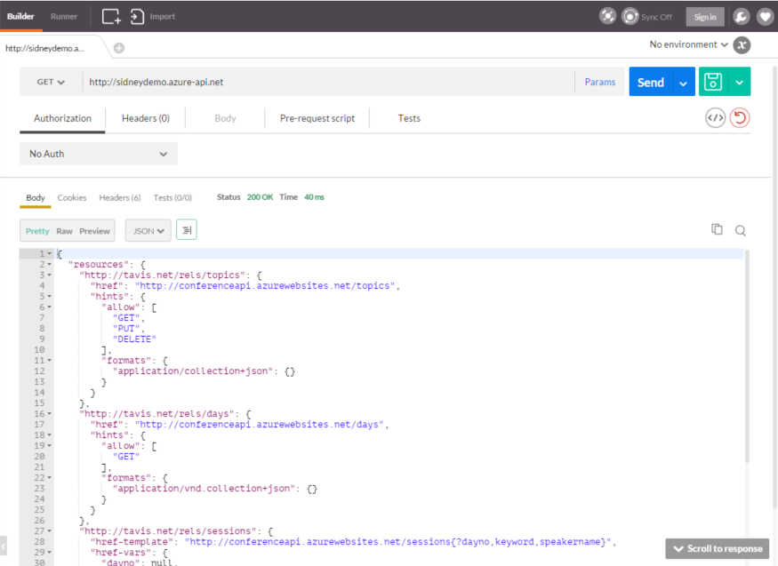

## Defining a Request/Response Policy

1. Return to the API management portal.

1. Go to the **Policies** section using the sidebar.

  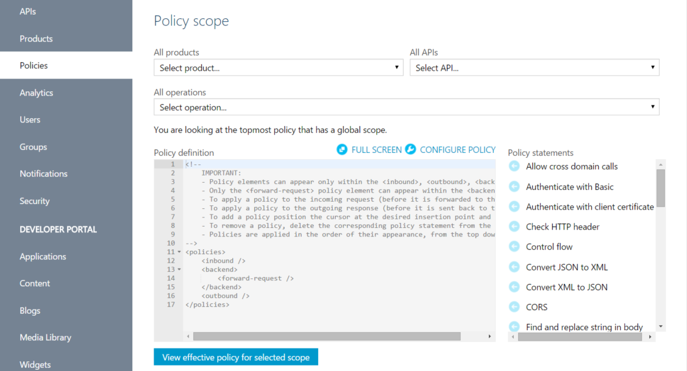

1. Click the **Configure Policy** link to enable the editor.

  

1. In the editor, remove the comments from the policy.

1. In the editor, locate the *self-closing* **Inbound tag**:

  ```xml
  <inbound />
  ```

1. Replace the tag with the following content:

  ```xml
  <inbound>
      <check-header name="User-Agent" failed-check-httpcode="400"
          failed-check-error-message="User Agent is a required header"
          ignore-case="true">
      </check-header>
  </inbound>
  ```

1. In the editor, locate the *self-closing* **Outbound tag**:

  ```xml
  <outbound />
  ```

1. Replace the tag with the following content:

  ```xml
  <outbound>
      <set-header name="X-AspNet-Version" exists-action="delete" />
      <set-header name="X-Powered-By" exists-action="delete" />
      <set-header name="pragma" exists-action="delete" />
	</outbound>
  ```

1. Click the **Save** button.

1. At this point your policy should look like this:

  

1. Return to your preferred HTTP request making tool.

  > **Note:** In these examples we will use screenshots from *Fiddler*.

1. Make a **GET** request to the API endpoint. If your tool supports it, remove the **User-Agent** header. In this example, we will use the URL: **http://sidneydemo.azure-api.net**

  > **Note:** Many tools will implicitly include a *User-Agent* header. Your request may not necessarily fail if the header is specified.

  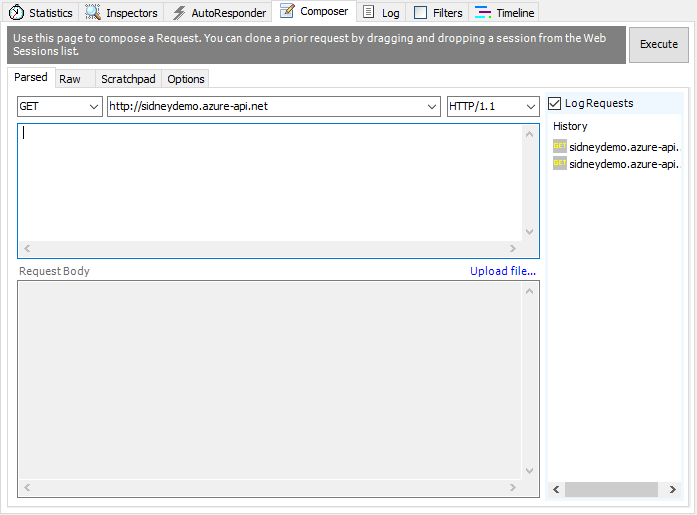

1. Your request should fail with a status code of **400 (Bad Request)**.

  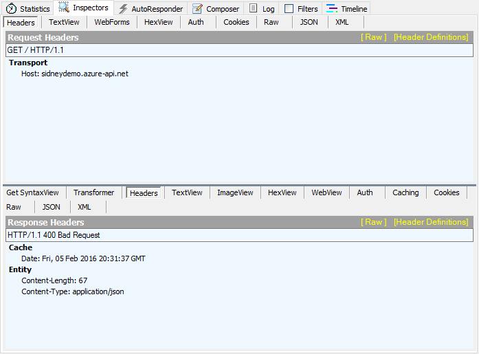

1. Add the **User-Agent** header back to your tool and specify any value. Make another **GET** request using this header.

  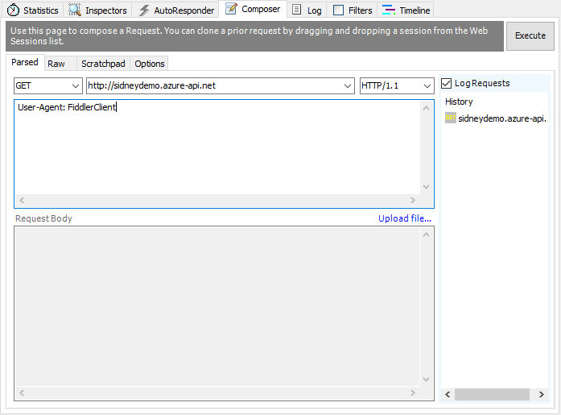

1. Your request should succeed with a status code of **200 (OK)** and contain a JSON body in the response.

  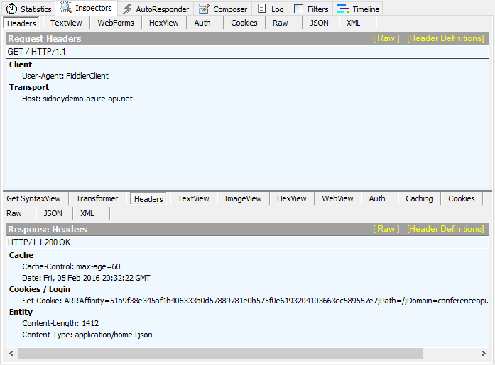

  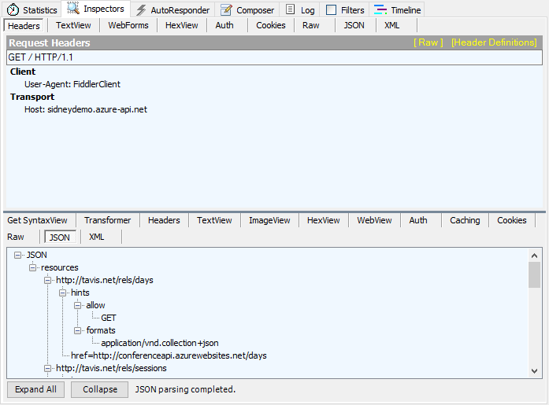

## Combining Policies and Products

1. Return to the API management portal.

1. Got to the **APIs** section using the sidebar.

  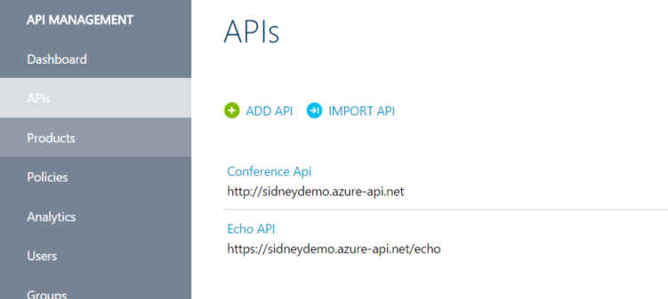

1. Select the **Conference Api** option.

1. Under the **Products** header, click the **Add API to Products** link.

  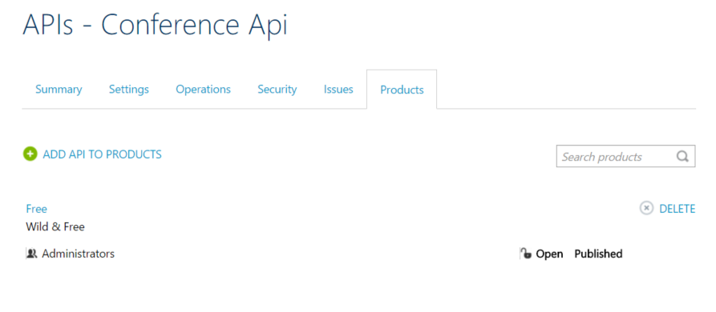

1. Select the **Starter** product and click the **Save** button.

  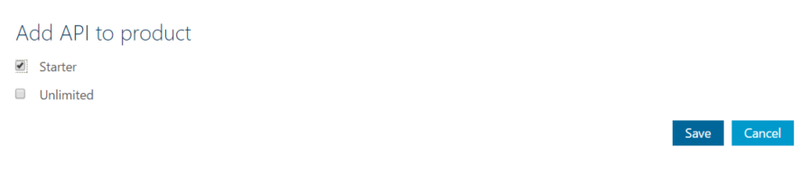

1. Click the **Delete** button next to the **Free** product in the list of Products associated with the *Conference Api* API. You will be prompted to confirm the action, click the **Yes, remove it** button.

  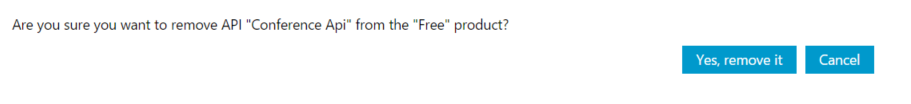

1. Go to the **Policies** section using the sidebar.

1. Under the **Policy scope** header, select the **Starter** product from the list of all products.

  

1. Click the **View Effective Policy** link for the currently selected scope. Your policy should be identical to this:

  

1. Return to your preferred HTTP request making tool.

  > **Note:** In these examples we will use screenshots from *Postman*.

1. Make a **GET** request to the API endpoint. Ensure that a **User-Agent** header is specified.

  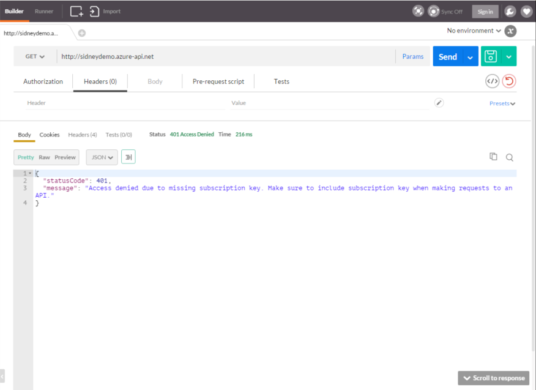

  > **Note:** Your request failed because we have not specified a subscription key as a request header.

1. Return to the API management portal.

1. Go to the **Users** section using the sidebar.

  

1. Select the **Administrator** user to view the user's details. Locate the **Starter** subscription in the *Subscriptions* list and then locate the **Primary key** entry. Click the **Show** link to view the key. Record the value of the key.

  

1. Return to your preferred HTTP request making tool.

  > **Note:** In these examples we will use screenshots from *Postman*.

1. Make a **GET** request to the API endpoint. Ensure that the following headers are specified:

  - **User-Agent:** any value
  - **Ocp-Apim-Subscription-Key:** the value for the key you recorded earlier

  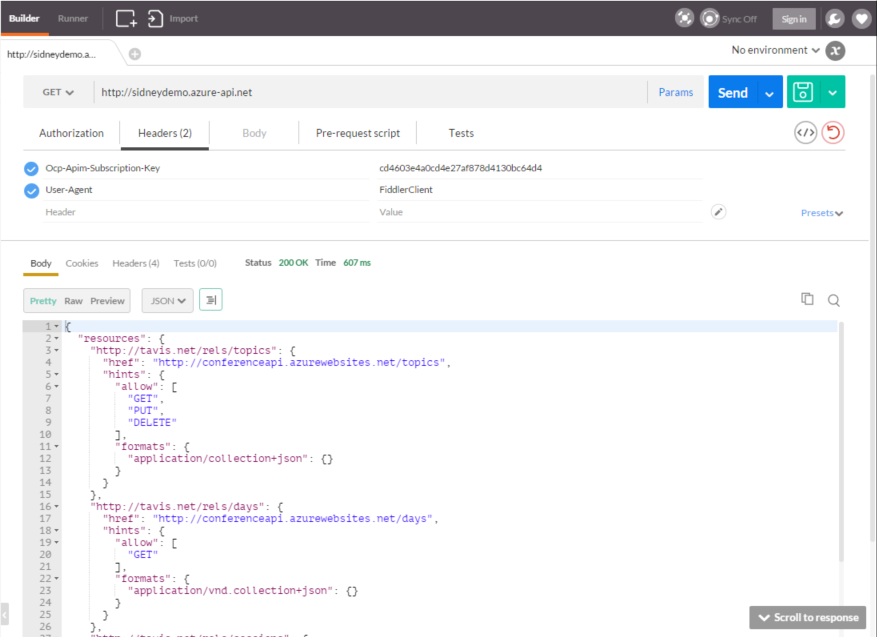

1. Make another **GET** request to the API endpoint. Ensure that the following headers are specified:

  - **User-Agent:** any value
  - **Ocp-Apim-Subscription-Key:** the value for the key you recorded earlier
  - **Ocp-Apim-Trace:** true

  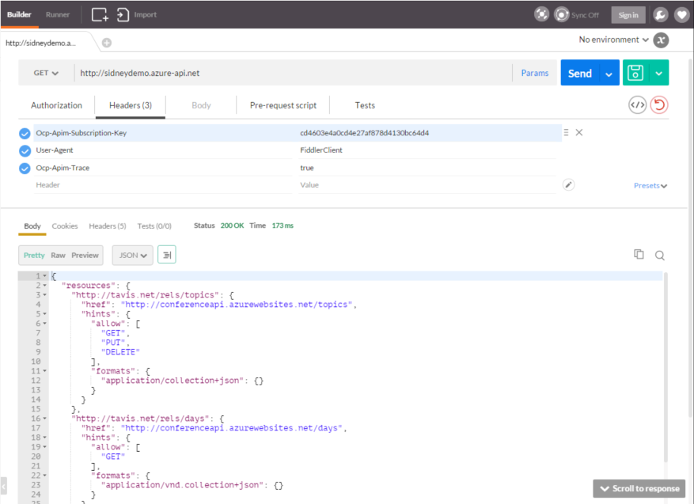

  > **Note:** This header enables debug (trace) information for the API Management service.

1. View the headers for your response and you will see a link to the location for the trace. Copy this url and navigate to it using your browser.

  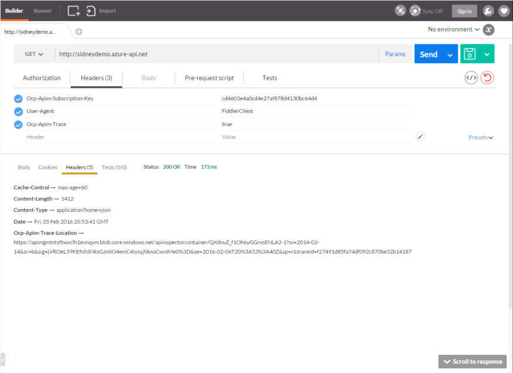

  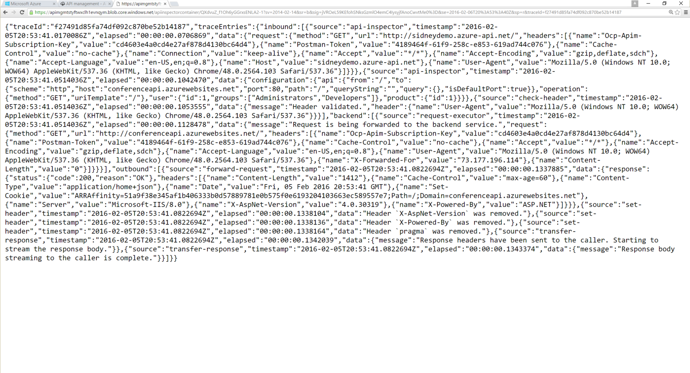

## Register for a Developer Account

1. Use an alternative browser or open up a private session in your browser of choice.

1. Navigate to the developer portal for your API. This can be found by adding **.portal** to the end of the name of your API Management account. For example, if your API Management account is named **sidneydemo**, your API URL is **https://sidneydemo.azure-api.net/** and your Developer Portal URL is **https://sidneydemo.portal.azure-api.net/**.

  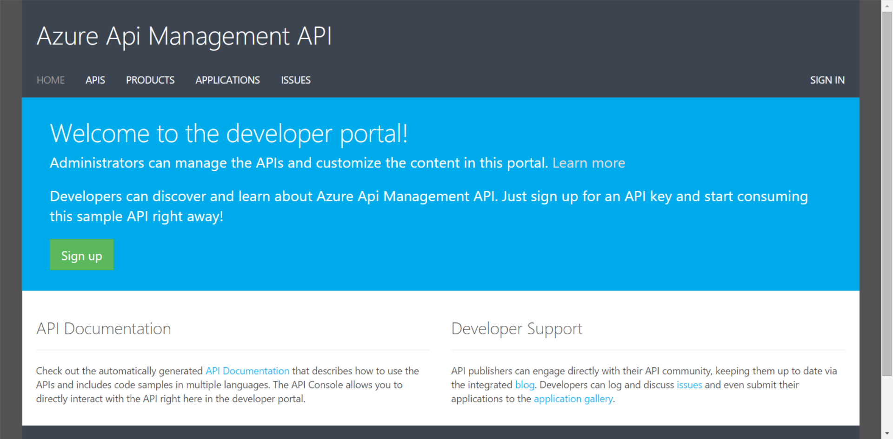

1. Click the **Sign In** link at the top-right corner of the page.

  

1. Click the **Sign up now** link. Fill out the form using a real e-mail address and then click the **Sign up** button.

  

1. You will receive a confirmation e-mail. Reply to that e-mail to verify your account.

  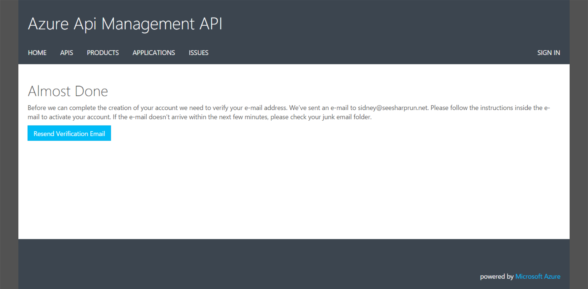

  > **Note:** This e-mail can appear in your Junk/Spam folders. Please check those folders before clicking the *Resend Verification Email* button.

1. Once you have verified your e-mail, you will be automatically signed in to your account.

  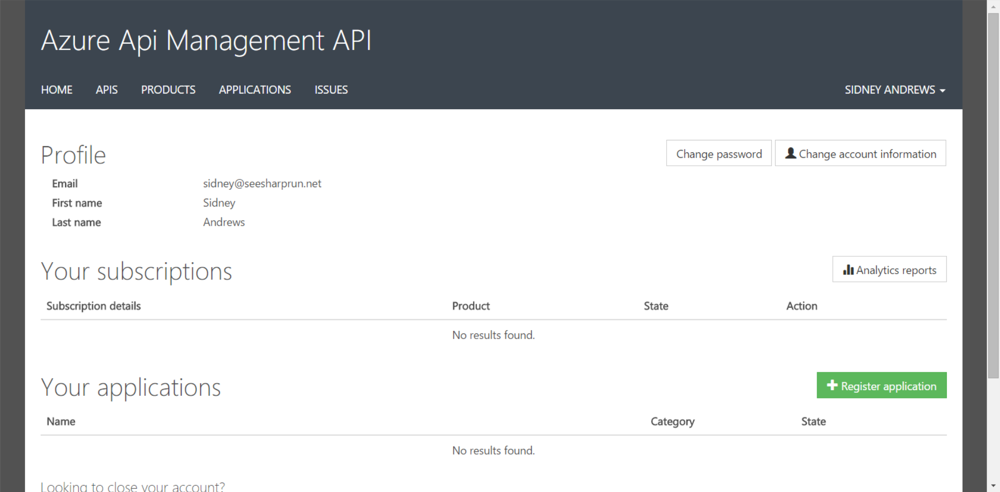

1. Click the **Products** link at the top of the page to see a list of Products.

  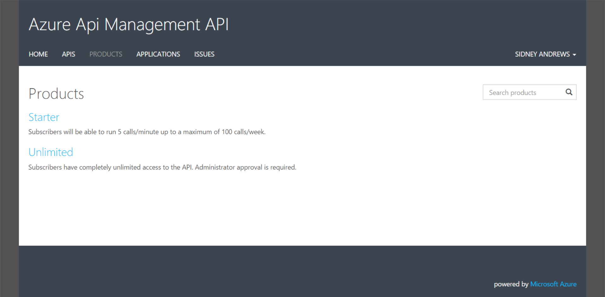

1. Select the **Starter** product and click the **Subscribe** button. You will be prompted to confirm a **Subscription name**, you can leave that set to the default value and click the **Confirm** button.

  

  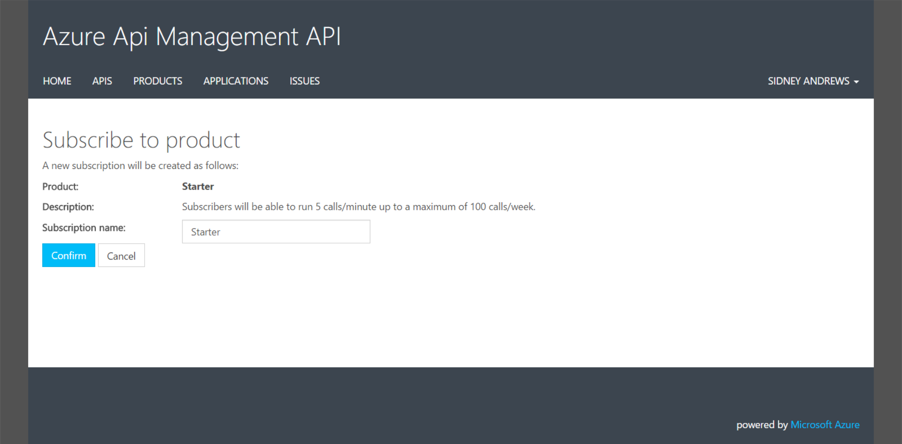

1. You will now be taken back to your profile where you will see a list of your subscriptions. Locate the **Starter** subscription in the *Your Subscriptions* list and then locate the **Primary key** entry. Click the **Show** link to view the key. Record the value of the key.

  

1. Click the **Register application** button.

1. Register any app name and description.

  

1. Click the **Submit** button to submit the application.

  

1. Click the **Submit for review** button. You will be asked to confirm your action. Click **OK**.

  

## Recap

In this exercise we:

  - Created a front-end for our API with API Management
  - We manipulated the contents of the request and response
  - We protected the API from unauthorized and abusive usage
  - We debugged API Management behavior
  - We created a developer account
